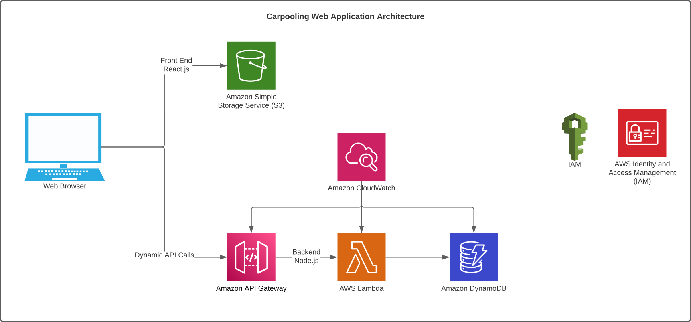
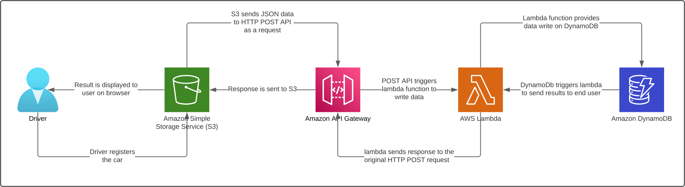
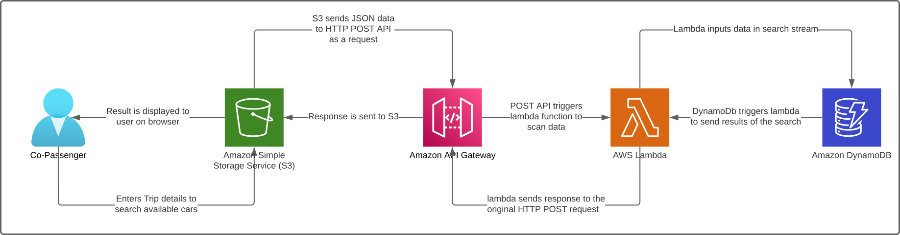
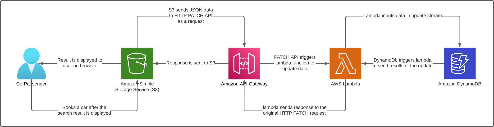

# RideTogether Inc. - CarPooling 🚗
CarPooling is a web-based application developed as part of the Cloud Computing project to showcase the utilization of various AWS cloud services for hosting and managing a web application.

## 🌐 Table of Contents
- [Overview](#overview)
- Architecture
- Frontend
- Backend
- Functionalities
- Register a Car
- Search for a Car
- Book a Car
- Repository Structure
- Getting Started
- Contributing
- License

## 📜 Overview
CarPooling is designed to bridge the gap between drivers and co-passengers, offering a platform where they can register, search, and book car rides seamlessly. With its modern web technologies and serverless architecture on AWS, CarPooling ensures a scalable, reliable, and secure user experience.

## 🏗 Architecture

### Frontend
- Framework: React.js
- Hosting: Amazon S3 bucket, ensuring a scalable and cost-effective solution for hosting static files.
### Backend
- Serverless Architecture: Provides flexibility and scalability, eliminating the need for traditional server-based setups.
- API Gateway: Manages and routes API calls from the frontend to the backend.
- Lambda Functions: Processes API calls and interacts with the database.
- DynamoDB: A NoSQL database service, perfect for storing unstructured data like car registration and booking details.
- CloudWatch: Monitors and logs backend activities, offering insights and troubleshooting capabilities.
- IAM (Identity and Access Management): Ensures security by creating users with limited access and defining policies for resource interactions.

## 🚀 Functionalities
### Register a Car
Drivers can offer their cars for carpooling by:
- Filling out a registration form with car details.
- Submitting the form, which triggers an API Gateway endpoint.
- Data is validated and stored in DynamoDB.
- Upon successful registration, drivers receive a confirmation message.

### Search for a Car
Prospective co-passengers can:
- Input search criteria on the application's search page.
- View matching car details based on their search parameters.

### Book a Car
Users can:
- Select a car from the search results.
- Provide booking details and submit.
- Receive a confirmation message upon successful booking.

## 📂 Repository Structure
- frontendcarpool: Contains all frontend-related files and configurations.
- service: Houses customer.js and driver.js for handling different service requirements.
- utils: Utility functions and helpers.
- index.js: Main entry point for the Lambda microservice.

## 🚀 Getting Started
Detailed setup and deployment instructions will be provided soon. Stay tuned!

## Live Demo
Experience the RideTogether Inc. website live [here](http://carpoooling-webapplication.s3-website-eu-west-1.amazonaws.com/).

## Contributing

Contributions to the RideTogether Inc. project are welcome. To contribute, follow these steps:

1. Fork the repository.
2. Create a new branch: `git checkout -b my-new-feature`
3. Make changes and commit them: `git commit -am 'Add some feature'`
4. Push to the branch: `git push origin my-new-feature`
5. Submit a pull request.

## License

The RideTogether Inc. project is licensed under the MIT License. See the [LICENSE](LICENSE) file for details.

## Acknowledgments

The RideTogether Inc. project was created as part of a cloud computing course. Thanks to the course instructors and fellow students for their support and feedback.